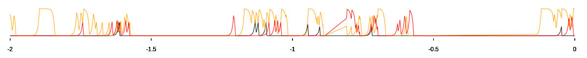

## About

TimePlot -- personal activity tracker & graph plotter.

## Usage

* Run "timeplot"
* Each 3 minutes your currently active window name is logged to `~/.local/share/timeplot/log.log`. Open the log to see if timeplot has categorized your activity correctly. It looks like this:
```
2018-10-01_14:00 skip 0 Desktop
2018-10-01_15:03 work 9 #rust @ irc.mozilla.org
2018-10-01_19:11 fun 18 The Battle for Wesnoth
2018-10-01_20:38 skip 0 Desktop
2018-10-01_21:31 personal 13 vasya@vn971think:~
```
* If the category is wrong, fix the category right in the log.
* Auto-categorize this window name in the future by editing rules: `~/.config/timeplot/rules_simple.txt`.
1. Wait for timeplot to log a new entry and re-draw the plot (`~/.cache/timeplot/svg.svg`)


1. Whenever you want to check the text log, or see if it can be improved, go back to step 3.

## Hints
* You can set this image as your Desktop background image if you like.
* You can configure the app-s dehavior by editing ~/.config/timeplot/config.toml
* If you have trouble finding the directories, run `timeplot` from terminal. It will print the directories.
* When doing categorization via rules_simple.txt, **the first matching entry** will be taken as window-s category. You can use that by placing strict rules on top, and more general ones on the bottom.
* If you're curious on what the number means in the logs: it means your desktop "workstation" number, usually 1-4. It's logged, but it's not yet usable in "rules_simple.txt". Hopefully it'll be usable in future versions of timeplot.

## Installation (ArchLinux)

TODO: AUR package


## Installation (Linux, simple)

* Install dependencies: `gnuplot` `xprintidle` `xdotool`
* Download the binary from https:// TODO
* Make it executable (for example, `chmod +x timeplot`)
* Run it


## Installation (MacOS, Linux)

* Install dependencies: `gnuplot` `xprintidle` `xdotool`
* Install `cargo` (the Rust build tool)
* Download this project-s sources, enter the directory and build: `cargo build --release`
* Run `target/release/timeplot`


## Building

* download the project
* Run `cargo build --release` in the main directory. The resulting binary is `target/release/timeplot`

## Other

The application only does what it says in this description. It never sends anything anywhere, never logs any kind of data except the one specified above.

The app is shared under GPLv3+. Sources can be found here [https://github.com/vn971/timeplot](https://github.com/vn971/timeplot) and here [https://gitlab.com/vn971/timeplot](https://gitlab.com/vn971/timeplot)
