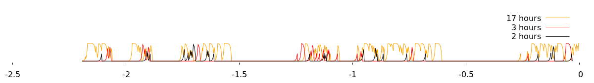

## About

TimePlot -- personal activity logger & visualizer.

Visualizing your performance can help you understand how certain things impact your computer work, properly bill customers for freelance tasks or potentially fight procrastination.
Or maybe just get new cool graphs.:)


## Usage

* Run "timeplot"
* Each 3 minutes your currently active window name is logged to `~/.local/share/timeplot/log.log`. Open the log to see if timeplot has categorized your activity correctly. It looks like this:
```
2018-10-01_14:00 skip 0 Desktop
2018-10-01_15:03 work 9 #rust @ irc.mozilla.org
2018-10-01_19:11 fun 18 The Battle for Wesnoth
2018-10-01_20:38 skip 0 Desktop
2018-10-01_21:31 personal 13 vasya@vn971think:~
```
* If the category is wrong, fix the category right in the log.
* Edit rules to auto-categorize this window name in the future: `~/.config/timeplot/rules_simple.txt`.
* Wait for timeplot to re-draw the plot (`~/.cache/timeplot/svg.svg`)
<!-- screenshot params: pngcairo 1200,170, 2.9 -->
* Whenever you want to check the text log, or see if it can be improved, return 3 steps back.


## Hints

* You can set the image as your Desktop background image if you like.
* You can configure the app by editing ~/.config/timeplot/config.toml  (plot a different number of days, configure colors, statistics display, etc).
* If you have trouble finding the directories, run `timeplot` from terminal. It will print the directories.
* If you're curious on what the number means in the logs: it means your desktop "workstation" number, usually 1-4. It's logged, but it's not yet usable in "rules_simple.txt". Hopefully it'll be usable in future versions of timeplot.


## Installation

1. Install dependencies `gnuplot`, `xprintidle` and `xdotool`:
* * On Debian/Ubuntu, `sudo apt install gnuplot xprintidle xdotool`
* * On macOS, same packages seem to be available, but I don't know installation best practices. PR anyone?
* * On Windows, Windows support is planned, but not there yet. Hopefully we'll get there in a couple of weeks.
2. Build the project:
* * On Linux, you can download pre-built version: [https://pointsgame.net/vn971/temp/tpl/timeplot](https://pointsgame.net/vn971/temp/tpl/timeplot)  and make it executable by doing `chmod +x timeplot`
* * On all other platforms, clone/download this repository, install `cargo`, build project with `cargo build --release`, observe the executable on "target/release/timeplot".
3. Run it.
4. Consider adding `timeplot` to autostart, making it run when you log in. If you use MacOS, you must create said autostart hook manually (help on making it automatic appreciated). For Linux users, there's a configuration setting that, if enabled, will create XDG autostart entry for you.


## Other

The application only does what it says in this description. It never sends anything anywhere, never logs any kind of data except the one specified above.

The app is shared under GPLv3+. Sources can be found here [https://github.com/vn971/timeplot](https://github.com/vn971/timeplot) and here [https://gitlab.com/vn971/timeplot](https://gitlab.com/vn971/timeplot)
